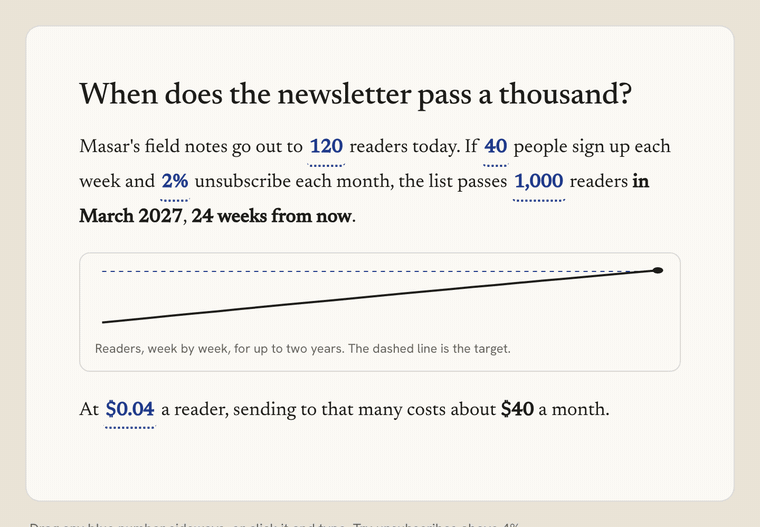
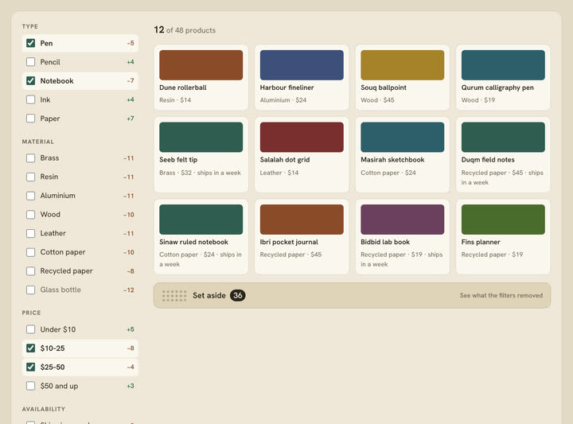
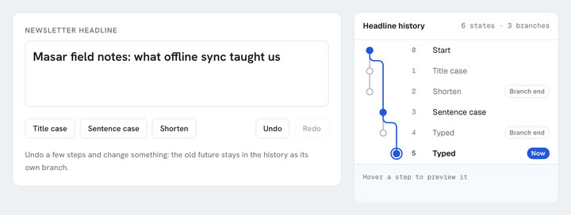
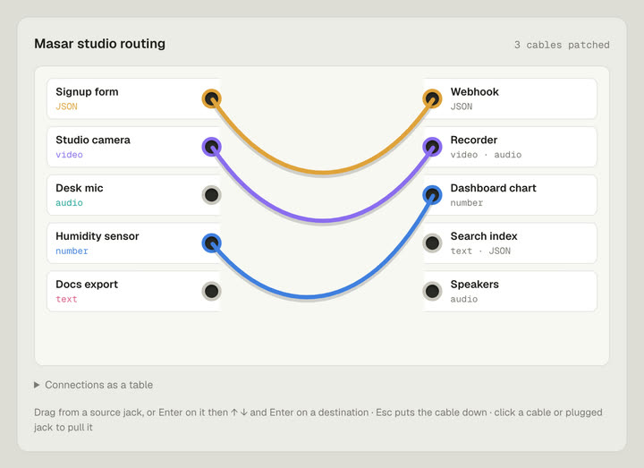
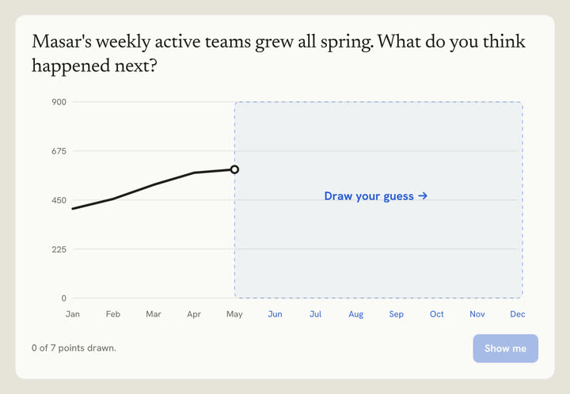
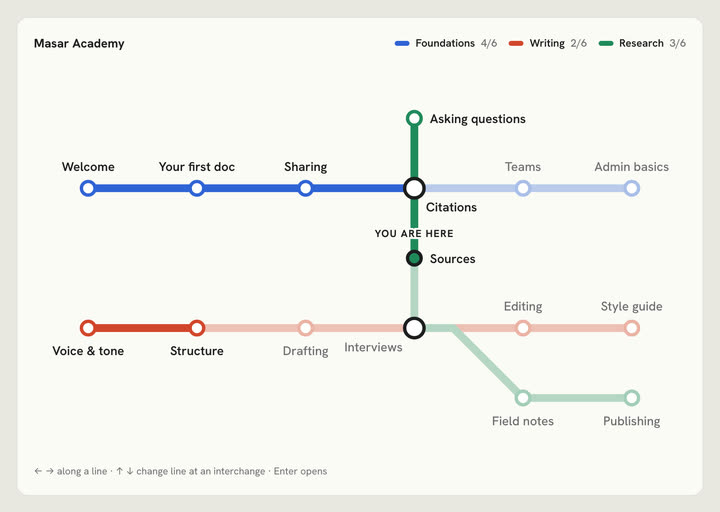
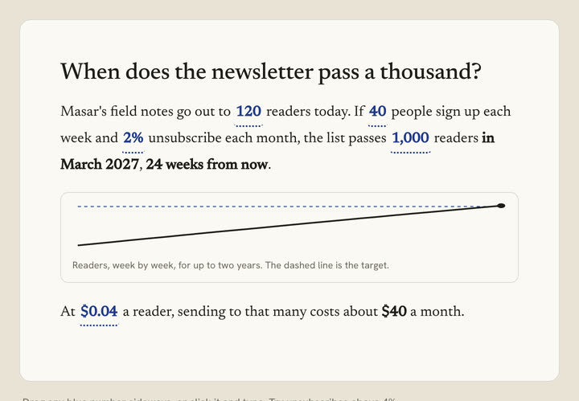

<div align="center">

# Vitrine

**Kept under glass.**

A curated collection of React components with memorable interactions.
Read the source, read the prompt behind it, and copy what you need.

[](./LICENSE)


[Browse the collection](https://tryvitrine.dev) · [How to use it](#how-to-use-a-component) · [How it's made](#how-vitrine-is-made) · [Workshop](#the-workshop) · [Contributing](#contributing)

<br>

<a href="https://tryvitrine.dev/components/reactive-prose"></a>

<sub>Reactive Prose, recorded from the live component: drag a number in the sentence and everything that depends on it recalculates.</sub>

</div>

---

## What is Vitrine?

A *vitrine* is a glass display case: you look, you don't touch. Vitrine is the one display where you're allowed to take the object.

Each component is built around **one clear idea**, often borrowed from a physical object (letterpress, split-flap boards, wet ink, a transit map, a patch bay) and kept useful. Every component comes with:

- a **live preview** with its variants,
- the **real source**, exactly what runs in the preview,
- the **design prompt** it was built from, detailed enough to rebuild or adapt it with an AI assistant,
- notes on **interaction, animation, accessibility, responsiveness and touch**.

There is no package, no CLI and no registry install. You copy the files into your project and they're yours.

## A closer look

<table>
<tr>
<td width="50%" valign="top">
<a href="https://tryvitrine.dev/components/sieve"></a>
<br><b><a href="https://tryvitrine.dev/components/sieve">Sieve</a></b> — filters that show their work. Every option previews how many items it would add or remove, and what you filtered out waits in a tray instead of vanishing.
</td>
<td width="50%" valign="top">
<a href="https://tryvitrine.dev/components/undo-tree"></a>
<br><b><a href="https://tryvitrine.dev/components/undo-tree">Undo Tree</a></b> — history that branches instead of forgetting. Undo, change something, and the old future stays in the tree as its own branch.
</td>
</tr>
<tr>
<td width="50%" valign="top">
<a href="https://tryvitrine.dev/components/patch-bay"></a>
<br><b><a href="https://tryvitrine.dev/components/patch-bay">Patch Bay</a></b> — routing as cables. Plugs refuse incompatible jacks and say why, and every connection is also available as a table.
</td>
<td width="50%" valign="top">
<a href="https://tryvitrine.dev/components/you-draw-it"></a>
<br><b><a href="https://tryvitrine.dev/components/you-draw-it">You Draw It</a></b> — a chart that asks for your guess before it shows the answer, then compares the two.
</td>
</tr>
<tr>
<td width="50%" valign="top">
<a href="https://tryvitrine.dev/components/line-map"></a>
<br><b><a href="https://tryvitrine.dev/components/line-map">Line Map</a></b> — structure drawn as a transit map. Arrow keys travel along a line; at interchanges you change lines.
</td>
<td width="50%" valign="top">
<a href="https://tryvitrine.dev/components/reactive-prose"></a>
<br><b><a href="https://tryvitrine.dev/components/reactive-prose">Reactive Prose</a></b> — text you can operate. Numbers in the sentence are controls, and the conclusion and chart follow them.
</td>
</tr>
</table>

## What's inside

**458 components in 32 categories.** The 50 newest carry a New label (`python3 scripts/limit-new.py` keeps it that way).

| Category | | Category | | Category | |
|---|---:|---|---:|---|---:|
| Buttons | 64 | Backgrounds | 45 | Cards | 39 |
| AI & Chat | 36 | Controls | 23 | Feedback | 22 |
| Stats | 18 | Analytics | 17 | Forms | 16 |
| Authentication | 15 | Data | 15 | Text Animations | 15 |
| Cursors | 14 | CTAs | 11 | Navigation | 10 |
| Type & Names | 10 | FAQ | 9 | Pricing | 9 |
| Sections | 9 | Heroes | 8 | Media | 8 |
| Micro-animations | 8 | Time | 7 | Overlays | 6 |
| Developer | 4 | Footers | 4 | Commerce | 3 |
| Decisions | 3 | Maps & Globes | 3 | Navbars | 3 |
| Reading | 2 | Sidebars | 2 | | |

<details>
<summary><b>A longer tour</b></summary>

- **Glassbreak Button**: a plate of dark glass that fractures from a single impact point, pure CSS and fully choreographed.
- **Silk Field**: a shader background you can set type on.
- **Specimen Card**: a card treated as a catalogued object.
- **Iris Shutter Button**: an action that opens and closes like a lens.
- **Prompt Composer, Thinking Trace, Cited Answer, Inline Diff**: the building blocks of a polished AI interface.
- **Split-Flap Text, Chrome Text, Extrude Text**: type that moves with intent.
- **Route Globe, Sankey Flow, Sunburst Drill, Cohort Retention**: data that rewards a closer look.
- **Trace 404, Forwarding 404, Underside 404**: missing pages that explain where the request stopped, where the page moved, or turn over to an index.
- **Insert Menu, Board View, Page Header**: a calm document editor's pieces, from the / menu to drag-and-drop status boards.
- **Lesson Path, Word Bank, League Table**: chunky, pressable learning UI where progress always says what it means.
- **Query Cell, Schema Drop, Column Profile**: a hard-edged data toolkit that parses CSV and profiles columns in the browser.
- **Card Wallet, Transfer Composer, Approval Inbox**: precise banking flows that await real callbacks and never fake success.
- **Reactive Prose, Stretchtext**: text you can operate. Drag a number in a sentence and the figures that depend on it recalculate; choose how deep an article goes and the detail grows inside its sentences.
- **Pairwise Ranker, Magnet Board, Allocation Faders**: decisions made visible. Rank by answering "this or that?", sort by dropping quality magnets on a board, split a budget on faders that always add up.
- **Sieve, Build Sheet, Gate Selector**: rules you can see. Filters that show what they removed, a configurator that explains its conflicts and offers the fix, a status control shaped like the workflow it allows.
- **Undo Tree, Shadow Board**: history that branches instead of forgetting, and toolbar customisation where every tool keeps its painted outline.
- **Line Map, Notification Dial, You Draw It**: structure drawn as a transit map, a setting that shows its consequence before you commit, and a chart that asks for your guess before it shows the answer.
- **Splice, Contact Sheet**: choosing as the main act. Assemble one text from the best sentences of several drafts; mark photos with a grease pencil on a light table.
- **Query Tokens, Keymap, Cron Builder, Scrub Number, Conflict Resolver**: tools for people who build. Filter syntax that stays editable, shortcuts on a drawn keyboard, schedules in three linked forms, design-tool number fields, and a three-way merge that only asks about real conflicts.
- **Transcript Player, Log Tail, Span Waterfall**: media and tooling you read as much as operate. A transcript that is the player, a live log that holds still when you scroll up, a trace drawn as bars with its critical path.
- **Segment Counter, Timezone Overlap, Patina**: the honest details. The one character that doubled your SMS bill, everyone's working hours on one axis, cards that visibly age until someone checks them.
- **Confidence Ink, Patch Bay, Fit Compare, Exploded View**: model uncertainty printed as lighter ink, routing as cables that sag, products shown at true size, and drawings that come apart.
- **Helix Showcase, Signal Tiles, Platform Downloads**: a portfolio wound into a spiral of curved cards that turns as you scroll, black service tiles that switch on with a dot field and a travelling border light, and download buttons that put the visitor's own system first.
- **Column Bloom, Satin Hero**: two heroes: a stepped orange glow ringed by keywords, and a headline pressed into drifting satin.
- **Obsidian Flow**: a background of slowly folding black liquid under a faint grid (it began as a hero; the old link redirects).
- **Refraction Blob, Ask Bar, Sweep Cards, Infinite Highlight Sweep**: a lumpy glass drop that reads a name through itself and turns with the scroll, an assistant's opening screen with one bar that grows, attaches and dictates, and pastel cards whose key phrases a demo cursor sweeps once. Highlight Sweep now plays once and rests; Infinite Highlight Sweep is the looping version.
- **Docket Nav, Running Head, Typeset Hero, Colophon Footer**: the structural pieces a real page needs, with the same care as the showpieces.
- **Phrase Date, Shortcut Palette, Nearest Page, Plain Consent**: the small, honest utilities: a date you can write in words, a palette that teaches its shortcuts, a 404 that finds the page you meant, cookie consent without the tricks.
- **Button Set, Danger, Hold to Delete, Type to Delete, Upload, Drop Zone, Avatar Upload, Live, Ping, Corner Cut, Corner Brackets**: the everyday set in eight styles, three kinds of delete (ask in place, hold, or type the name) that all end in an undo, three kinds of upload that become their own progress, three kinds of live and attention button, and two kinds of chamfered panel button.
- **Status Badge, Alert Callout**: twelve statuses with their own marks in four looks, and alerts in four tones and four looks that fold away.
- **Linear, Segmented, Indeterminate and Ring Progress**: four kinds of progress, each its own component.
- **Activity, Changelog and Milestone Timelines**: a live feed grouped by day, release notes with tagged changes, and a roadmap with its line filled up to today.
- **Halftone Rise, Orbit Dawn, Light Pour, Haze Tier Card**: a dome of light printed as a pixel-scale copper dither, a ringed dawn rising under a faint star chart, a shaft of light that pours down and flares across the floor, and a pricing tier whose edges glow with drifting haze. Each comes in four colours.
- **Frost Bloom, Prism Rim, Nebula Pill, Call Pill, Bell Subscribe, Glyph Halo Composer, Afterglow Prompt**: glass pills tinted from inside, a dark pill in a hairline spectrum, clouds of colour under grain, a booking button with a breathing dot, a neo-brutalist subscribe toggle that rings, and two AI prompt boxes, one glowing from both ends over drifting characters and one with a rim lit like a low sun.
- **Conduit, Light Leak, Aurora Foot and Rim Glow Cards, Credit Tier Pricing**: light as the material. A card a beam pours through, a card lit through its top edge, cards whose feet catch fire in four colours, tiles rim-lit from below, and a three-plan pricing section over a glowing dome of dots.
- **Filter Step Card, Ember Globe, Point Bloom, Glow Base Pricing**: a step card whose filter panel really filters, a turning sphere of ember and white points, nested shells of points folding like membranes, plans glowing from their base.
- **Aurora, Shine and Spotlight Text; Hover, Scroll, Echo and Marquee Outline Text**: gradient fills that drift, glint or follow the pointer, and hairline lettering that fills on hover, on scroll, as echoes or in a marquee.
- **Line Chart, Bar Chart, Donut Chart**: dashboard charts with morphing ranges, grouped and stacked bars that slide between layouts, a ring that steps out a part, keyboard reading and data tables.
- **Smart Download** and **Platform Badges** are now two components (the badges come in solid, outline or light), and Refraction Blob, Helix Showcase and Satin Hero have new navigation.

</details>

## How to use a component

1. **Find it**: browse by category or search (press **⌘K** / **Ctrl K** in the gallery and try "glass", "hover" or "authentication").
2. **Inspect it**: open the component to see it full size, switch variants, and read the source and the prompt.
3. **Copy it**: copy every listed file into one folder in your project, including `usage.tsx`. Keep any `.css` next to the component.
4. **Make it yours**: colours, sizes and timings live in props and CSS variables at the top of each file. You own and maintain the copied code.

The code tab reads the real files at build time, follows local imports and rewrites them into one portable folder. The exported `usage.tsx` keeps demonstration links inside the example; the reusable components still accept real URLs. The release check compiles all 458 exported examples in isolation.

> **Fonts.** Components name their fonts in CSS (Geist, Instrument Serif, Anton, Archivo, IBM Plex…). Each component page lists the fonts found in its source; add those families to your project. In the gallery, demo fonts load through `src/site/ComponentFonts.tsx` and the site's own fonts are self-hosted through Fontsource packages.

## How Vitrine is made

- **An idea and a brief first.** Each component starts from one specific interaction idea and a written brief: geometry, states, timing, accessibility and fallbacks. That brief ships with the component as its prompt.
- **AI-assisted implementation.** AI coding tools help write the code. The direction, the choice of what goes into the collection and the review of each piece are done by the maintainer, Hamza Al-Bulushi.
- **Automated checks.** `npm run release:check` (also run in CI) checks prompts and variants against the code, registry consistency and CSS isolation, compiles every exported example in an isolated project, runs scripted interaction tests for a subset of components, and builds the site. The production route and browser checks load every component page and preview state.
- **Manual review.** Components are reviewed in the browser, including at narrow widths, with the keyboard and with reduced motion, but the depth of manual testing varies from piece to piece.
- **What the checks don't prove.** Keyboard access, focus, reduced motion and touch fallbacks are requirements for every component, but automated checks can't establish full accessibility. Test with your own content and assistive technology before you ship. If something falls short, please [open an issue](https://github.com/ham7a311/vitrine/issues/new).

## Run the gallery locally

Requirements: **Node 22.6+** (24 recommended) and **Python 3** (used by the registry generator).

```bash
git clone https://github.com/ham7a311/vitrine.git
cd vitrine
npm install
npm run dev          # http://localhost:3000
```

Other scripts:

```bash
npm run build        # production build of every page
npm run typecheck    # tsc --noEmit
npm run registry     # regenerate the registry index + run the prompt guard
```

## The Workshop

Vitrine also shows how to build with the collection.

**Recipes** are complete pages made only from Vitrine components, each with creative direction, a section-by-section component plan, and a copyable build brief:

The Portfolio · The Glass Portfolio · The Showcase · The Studio · The Launch · The Console · The AI Workspace · The AI Company

**Skills** are 19 reusable AI workflows written as `SKILL.md` files that work in Claude Code, Claude.ai projects, Cursor rules and ChatGPT projects:

| Stage | Skills |
|---|---|
| **Design** | Art Director · Design Critic · Template Tells · Interface Copy · Motion Critic · Theme System · Copy Quality · Landing Page Art Director · Portfolio Art Director · Content Structure Auditor |
| **Build** | Component Author · Component Architect |
| **Check** | Responsive Auditor · Accessibility Auditor · Performance Auditor |
| **Grow** | SEO Auditor · Technical SEO Audit · Search Optimization · Conversion UX Review |

The skill files live in `src/workshop/skills/<name>/SKILL.md`.

## Component rules

Every component in the collection follows the same contract:

- React + TypeScript. Tailwind only where it helps. Plain CSS for real keyframes. **No animation libraries.**
- Colours are defined by the component itself (CSS variables or props). Nothing reads the gallery's tokens.
- Keyboard access, visible focus, `prefers-reduced-motion`, and a touch fallback for hover-dependent behaviour.
- WebGL/canvas components pause offscreen and in hidden tabs, cap DPR and degrade gracefully.
- Demo content is fictional.

A **prompt guard** (`scripts/check-prompts.mts`) enforces that variant prompts describe only the selected option, so a component's brief never drifts from what it shows.

## Project structure

```
src/
  app/            Next.js App Router: home, /components, /components/[slug], /categories, /about, /workshop
  site/           the gallery shell (navbar, search palette, preview stage, code viewer), not meant to be copied
  lib/            search scorer, build-time source loader (shiki)
  workshop/       recipes, skills (SKILL.md) and live recipe previews
  registry/
    <category>/<slug>/
      <Name>.tsx  the component
      <name>.css  keyframes / complex selectors, when needed
      demo.tsx    what the gallery renders (also shown as usage.tsx)
      meta.ts     name, category, tags, prompt, interaction, a11y, variants…
    order.txt     curated gallery order
    gen.py        `npm run registry` regenerates index.ts + demos.tsx from order.txt
scripts/          prompt guard
```

## Adding a component

1. Create `src/registry/<category>/<slug>/` with the component, an optional `.css`, a `demo.tsx` (default export, receives `{ variant }`) and a `meta.ts`.
2. Add `<category>/<slug>` to `src/registry/order.txt`.
3. Run `npm run registry`.

Read [CONTRIBUTING.md](./CONTRIBUTING.md) for the full checklist.

## Tech

Next.js 15 (App Router) · React 19 · TypeScript · Tailwind CSS 4 · shiki for build-time syntax highlighting. Playwright is used for development tooling only.

## FAQ

**Is there an npm package or CLI?**
No, on purpose. Copy the files you want. You own the code and there is nothing to upgrade.

**Can I use these in commercial projects?**
Yes. Vitrine is MIT licensed.

**Do I have to credit Vitrine?**
No, but a link is always appreciated.

**Do the components need Tailwind or Framer Motion?**
No animation library is used anywhere. The gallery shell uses Tailwind; components use it only where it helps, and plain CSS for the rest. Each component's `meta.ts` lists its dependencies.

**Can I paste a component's prompt into an AI tool?**
That's what it's for. Each prompt describes geometry, timing, states and fallbacks precisely enough to rebuild or adapt the piece.

## Contributing

Contributions are welcome: new components that fit the collection, accessibility fixes, bug fixes and docs. Please read [CONTRIBUTING.md](./CONTRIBUTING.md) first. It covers the component rules, how to add one, and the licence terms for contributions (MIT, with commit sign-off).

## Feedback and contact

Found a bug or want a component that isn't here? [Open an issue](https://github.com/ham7a311/vitrine/issues/new). For anything else, the [contact page](https://tryvitrine.dev/contact) lists the right channel. The site's [terms](https://tryvitrine.dev/terms) and [privacy notes](https://tryvitrine.dev/privacy) explain how it may be used and what it collects.

## Licence

[MIT](./LICENSE) © 2026 Hamza Al-Bulushi. Copy the components into your own projects, commercial or not.

## Release verification

Run `npm ci` and `npm run release:check`. This validates prompts and variants, registry consistency, CSS isolation, all portable examples, authentication failure/retry behavior, and the production build. `npm audit --audit-level=moderate` checks the installed dependency advisories.

For production route and browser checks, build and start on port 3147, then run `npm run test:routes` and `npm run test:browser`, then `npm run test:expansion-browser`. The expansion browser check saves responsive screenshots and verifies seamless partner loops in both directions. Install the test browser with `npx playwright install chromium`. Set `VITRINE_TEST_URL` to test another deployment. CI runs these checks automatically. To avoid sharing output with a running development server, set `VITRINE_DIST_DIR=.next-release` for both build and start.

Prompts include the selected variant (including theme-only variants), interaction, motion, accessibility, responsive and touch requirements. The checks verify composition and selection; AI-generated results still need review against the live preview and source.

### Authentication examples

The gallery demonstrates UI. It does not authenticate visitors or send email. Passkey Sign-in requires `verify`, One-Field Sign-in requires `sendCode` and `verify`, and Code Cascade Verify requires `verify`. Optional email/resend actions appear only when their callbacks are supplied. Demo callbacks live in `usage.tsx`; replace them with your own server-backed integrations before production use. Never accept an authentication result solely on the client.
